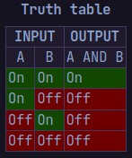
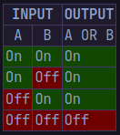
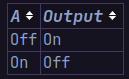
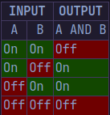
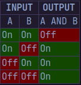
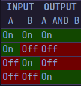

# Supplemental Reading: Logic Gates

Imagination for how logic gates work: [[3. Binary#^a71a66|here]]
- Logic Gate = Used to conduct electricity based on a rule
- Work on 2 states: Positive Level(On) & 0 Level(Off)
- On --> Voltage -> Positive -> b/w 3.5 to 5 volts
- Off --> Voltage -> 0
- Compare the state of their inputs -> decide what output should be
- if rules correctly met: on/active
	- Electricity flowing through the gate 
- Electronic version of boolean logic
- Truth tables -> tell what output will be
	- depending on the inputs

## Types of Logic Gates
```ad-note
title: AND Logic Gate
collapse: close

- 2 inputs
- output is on
	- only if both inputs -> on
	- If one input off -> off



```
```ad-note
title: OR Logic Gate
collapse:close

- 2 inputs
- output is on
	- one of 2 inputs -> on
	- both input off -> off



```
```ad-note
title: NOT Logic Gate
collapse:close

- 1 input
- output on -> input off
- output off -> input on
- Also known as "inverter"



```
```ad-note
title: XOR Logic Gate
collapse:close

XOR = exclusive or
- 2 inputs
- output = true
	- only if 2 inputs are different from each other
	- i.e: A not= B
- output = false
	- both inputs are same
	- i.e: A = B



```
```ad-note
title:NAND Logic Gate
collapse:close

NAND = not both (not and)

- 2 inputs
- output = true
	- either 1 should be off
- output = false
	- both on



```
```ad-note
title: XNOR Logic Gate
collapse: close

XNOR = not exclusive or
- 2 inputs
- output = true
	- both inputs same
	- i.e: A=B
- Opposite of XOR



```
